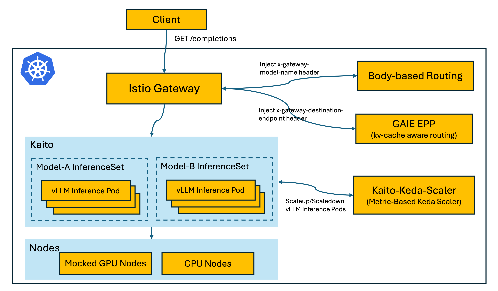

# Production Stack

This project provides a reference implementation on how to build an inference stack on top of [Kaito](https://github.com/kaito-project/kaito).

## Architecture

### Components

- **Istio Gateway** — Entry point for all inference requests. Routes client requests (e.g., `GET /completions`) through the stack.
- **Body-based Routing** — Parses request body to extract the model name and injects the `x-gateway-model-name` header, enabling model-level routing.
- **GAIE EPP (Gateway API Inference Extension Endpoint Picker)** — Performs KV-cache aware routing by injecting the `x-gateway-destination-endpoint` header, directing requests to the optimal inference pod.
- **Kaito InferenceSet** — Manages groups of vLLM inference pods. Multiple InferenceSets (e.g., Model-A, Model-B) can run different models simultaneously.
- **vLLM Inference Pods** — Serve model inference requests using [vLLM](https://github.com/vllm-project/vllm).
- **Kaito-Keda-Scaler** — Metric-based autoscaler built on [KEDA](https://keda.sh/) that scales vLLM inference pods up and down based on workload metrics.
- **Mocked GPU Nodes / CPU Nodes** — Infrastructure layer providing compute resources for inference workloads.

### Component Versions

All component versions are centralized in [`versions.env`](versions.env). This file is the single source of truth used by both CI and local E2E scripts.

| Component | Version | Variable |
|---|---|---|
| Go toolchain | 1.26.1 | `GO_VERSION` |
| KAITO workspace operator | v0.9.1 | `KAITO_VERSION` |
| Istio | 1.29.0 | `ISTIO_VERSION` |
| Gateway API CRDs | v1.2.0 | `GATEWAY_API_VERSION` |
| BBR (Body-Based Router) | v1.3.1 | `BBR_VERSION` |
